## AMPs present in all samples

### Classification and Secuenceuence
| Transcript                 | Best-hit                     | AMP                      | Secuence                    |
| -------------------------- | ---------------------------- | ------------------------ | --------------------------- |
| TRINITY_DN145857_c2_g1_i5  | Faecalibacterium prausnitzii | AMP_145857_c2_g1_i5.p4   | ENEWNIRRRGGFDRSEESQGLTEHGNC |
| TRINITY_DN134571_c44_g1_i3 | Not assigned                 | AMP_134571_c44_g1_i3.p7  | MGSTPIASTNM                 |
| TRINITY_DN143867_c81_g1_i4 | Eubacteriales                | AMP_143867_c81_g1_i4.p7  | GQDAG                       |
| TRINITY_DN145422_c2_g1_i16 | Faecalibacterium prausnitzii | AMP_145422_c2_g1_i16.p11 | MKRPVQPEK                   |
| TRINITY_DN144440_c1_g1_i2  | Not assigned                 | AMP_144440_c1_g1_i2.p8   | MGSTPIAST                   |
| TRINITY_DN383713_c2_g1_i1  | Not assigned                 | AMP_383713_c2_g1_i1.p8   | MGSTPIASTND                 |
| TRINITY_DN144616_c7_g3_i6  | Eubacteriales                | AMP_144616_c7_g3_i6.p5   | GDANPRLVSCGAALYKWR          |
| TRINITY_DN144746_c5_g1_i1  | Clostridium                  | AMP_144746_c5_g1_i1.p8   | MRGHTGLMSSVKLSC             |
| TRINITY_DN143402_c2_g1_i6  | Eubacteriales                | AMP_143402_c2_g1_i6.p8   | EESPGFAGQAAG                |
| TRINITY_DN144878_c1_g1_i1  | Faecalibacterium prausnitzii | AMP_144878_c1_g1_i1.p9   | KKKGAKTEG                   |
| TRINITY_DN141259_c3_g4_i3  | Eubacteriales                | AMP_141259_c3_g4_i3.p6   | MQQH                        |
| TRINITY_DN145462_c0_g1_i9  | Faecalibacterium prausnitzii | AMP_145462_c0_g1_i9.p9   | MGDYAAL                     |
| TRINITY_DN145289_c1_g1_i1  | Faecalibacterium prausnitzii | AMP_145289_c1_g1_i1.p7   | MGGYAAL                     |

### Heatmap
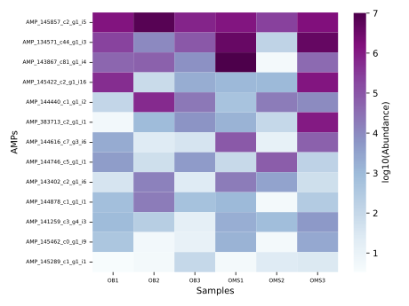

### Individual boxplots
#### AMP_145857_c2_g1_i5.p4
| Transcript                | Best-hit                     | AMP                    | Secuence                    |
| ------------------------- | ---------------------------- | ---------------------- | --------------------------- |
| TRINITY_DN145857_c2_g1_i5 | Faecalibacterium prausnitzii | AMP_145857_c2_g1_i5.p4 | ENEWNIRRRGGFDRSEESQGLTEHGNC |

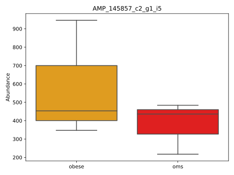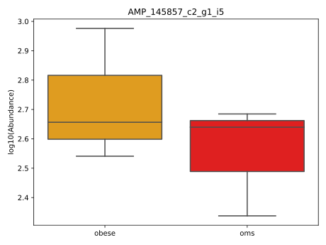

#### AMP_134571_c44_g1_i3.p7

| Transcript                 | Best-hit     | AMP                     | Secuence    |
| -------------------------- | ------------ | ----------------------- | ----------- |
| TRINITY_DN134571_c44_g1_i3 | Not assigned | AMP_134571_c44_g1_i3.p7 | MGSTPIASTNM |

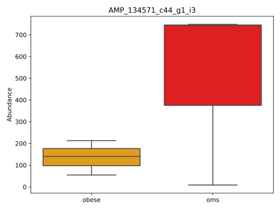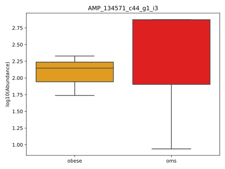

#### AMP_143867_c81_g1_i4.p7

| Transcript                 | Best-hit      | AMP                     | Secuence |
| -------------------------- | ------------- | ----------------------- | -------- |
| TRINITY_DN143867_c81_g1_i4 | Eubacteriales | AMP_143867_c81_g1_i4.p7 | GQDAG    |

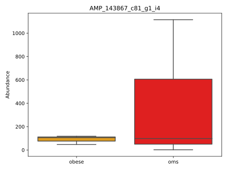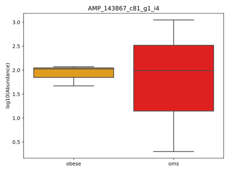

#### AMP_145422_c2_g1_i16.p11

| Transcript                 | Best-hit                     | AMP                      | Secuence  |
| -------------------------- | ---------------------------- | ------------------------ | --------- |
| TRINITY_DN145422_c2_g1_i16 | Faecalibacterium prausnitzii | AMP_145422_c2_g1_i16.p11 | MKRPVQPEK |

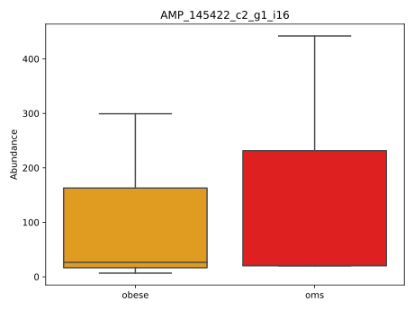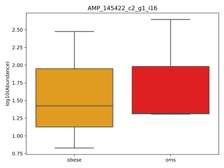

#### AMP_144440_c1_g1_i2.p8

| Transcript                | Best-hit     | AMP                    | Secuence  |
| ------------------------- | ------------ | ---------------------- | --------- |
| TRINITY_DN144440_c1_g1_i2 | Not assigned | AMP_144440_c1_g1_i2.p8 | MGSTPIAST |

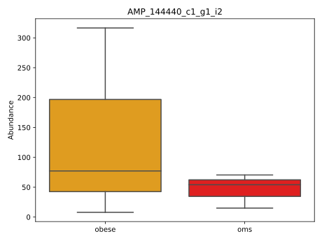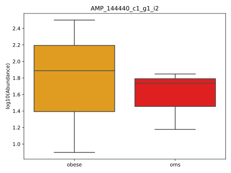

#### AMP_383713_c2_g1_i1.p8

| Transcript                | Best-hit     | AMP                    | Secuence    |
| ------------------------- | ------------ | ---------------------- | ----------- |
| TRINITY_DN383713_c2_g1_i1 | Not assigned | AMP_383713_c2_g1_i1.p8 | MGSTPIASTND |

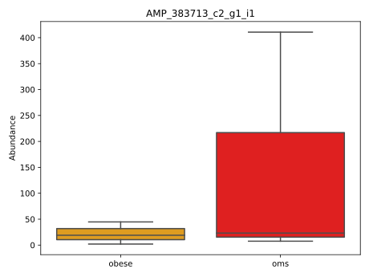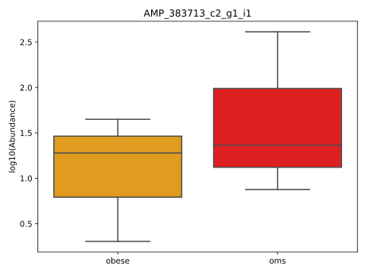

#### AMP_144616_c7_g3_i6.p5

| Transcript                | Best-hit      | AMP                    | Secuence           |
| ------------------------- | ------------- | ---------------------- | ------------------ |
| TRINITY_DN144616_c7_g3_i6 | Eubacteriales | AMP_144616_c7_g3_i6.p5 | GDANPRLVSCGAALYKWR |

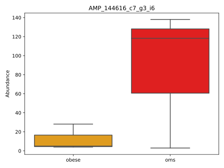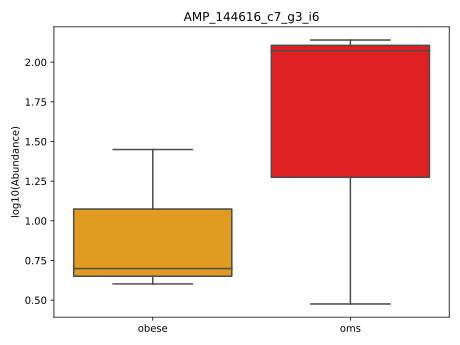

#### AMP_144746_c5_g1_i1.p8

| Transcript                | Best-hit    | AMP                    | Secuence        |
| ------------------------- | ----------- | ---------------------- | --------------- |
| TRINITY_DN144746_c5_g1_i1 | Clostridium | AMP_144746_c5_g1_i1.p8 | MRGHTGLMSSVKLSC |

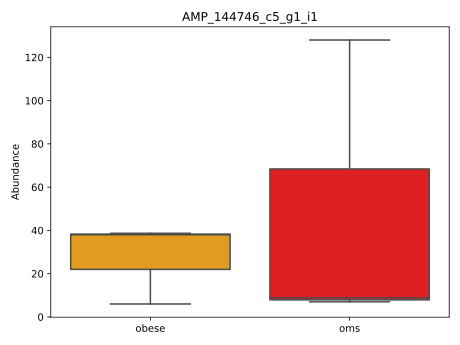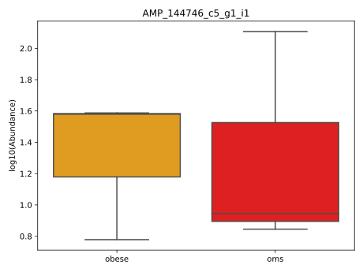

#### AMP_143402_c2_g1_i6.p8

| Transcript                | Best-hit      | AMP                    | Secuence     |
| ------------------------- | ------------- | ---------------------- | ------------ |
| TRINITY_DN143402_c2_g1_i6 | Eubacteriales | AMP_143402_c2_g1_i6.p8 | EESPGFAGQAAG |

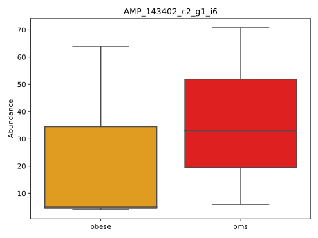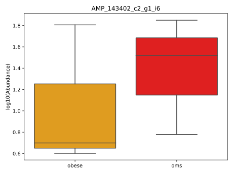

#### AMP_144878_c1_g1_i1.p9

| Transcript                | Best-hit                     | AMP                    | Secuence  |
| ------------------------- | ---------------------------- | ---------------------- | --------- |
| TRINITY_DN144878_c1_g1_i1 | Faecalibacterium prausnitzii | AMP_144878_c1_g1_i1.p9 | KKKGAKTEG |

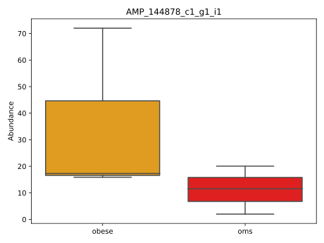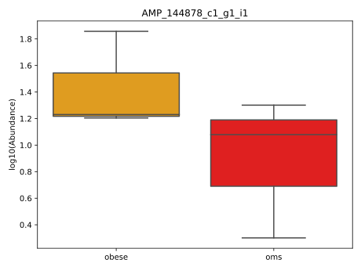

#### AMP_141259_c3_g4_i3.p6

| Transcript                | Best-hit      | AMP                    | Secuence |
| ------------------------- | ------------- | ---------------------- | -------- |
| TRINITY_DN141259_c3_g4_i3 | Eubacteriales | AMP_141259_c3_g4_i3.p6 | MQQH     |

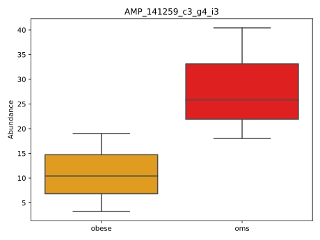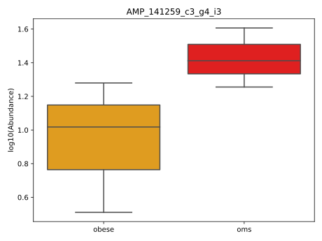

#### AMP_145462_c0_g1_i9.p9

| Transcript                | Best-hit                     | AMP                    | Secuence |
| ------------------------- | ---------------------------- | ---------------------- | -------- |
| TRINITY_DN145462_c0_g1_i9 | Faecalibacterium prausnitzii | AMP_145462_c0_g1_i9.p9 | MGDYAAL  |

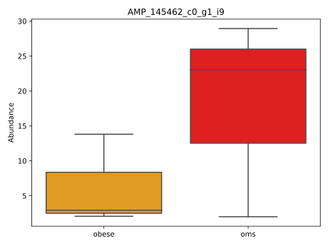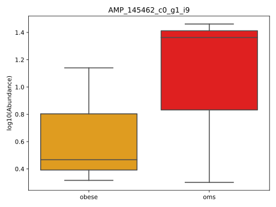

#### AMP_145289_c1_g1_i1.p7

| Transcript                | Best-hit                     | AMP                    | Secuence |
| ------------------------- | ---------------------------- | ---------------------- | -------- |
| TRINITY_DN145289_c1_g1_i1 | Faecalibacterium prausnitzii | AMP_145289_c1_g1_i1.p7 | MGGYAAL  |

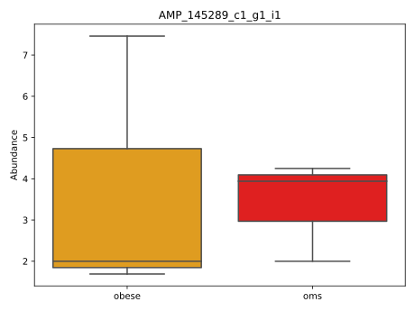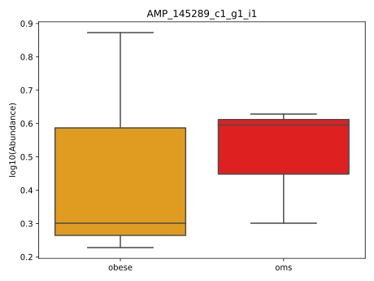