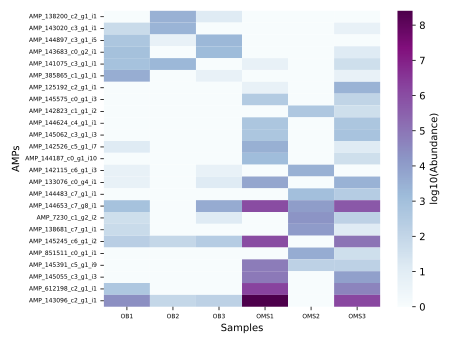

## Overexpressed AMPs

### Heatmap

### Classification and secuences overexpressed AMPs O group

| Transcript                | Best-hit                     | AMP                     | Secuence                                                     |
| ------------------------- | ---------------------------- | ----------------------- | ------------------------------------------------------------ |
| TRINITY_DN145418_c1_g1_i2 | Bacteriophage sp.            | AMP_145418_c1_g1_i2.p5  | EGIGA                                                        |
| TRINITY_DN138200_c2_g1_i1 | Bacteroides faecis           | AMP_138200_c2_g1_i1.p2  | MRIITSYCWKIIYKSGMRVRVLTNNSARFIGGCQTSTGTCTTRGYKFGPEVWMVFRTPDQRTLADSPEPGKP |
| TRINITY_DN144897_c3_g1_i5 | Faecalibacterium prausnitzii | AMP_144897_c3_g1_i5.p10 | MKRPVQTEK                                                    |
| TRINITY_DN142228_c6_g1_i1 | Parabacteroides sp.          | AMP_142228_c6_g1_i1.p9  | MLTNHFNP                                                     |

---
### Individual boxplots and genomic context

#### AMP_145418_c1_g1_i2.p5
| Transcript                | Best-hit                     | AMP                     | Secuence                                                     |
| ------------------------- | ---------------------------- | ----------------------- | ------------------------------------------------------------ |
| TRINITY_DN145418_c1_g1_i2 | Bacteriophage sp.            | AMP_145418_c1_g1_i2.p5  | EGIGA                                                        |

#### AMP_138200_c2_g1_i1.p2
| Transcript                | Best-hit                     | AMP                     | Secuence                                                     |
| ------------------------- | ---------------------------- | ----------------------- | ------------------------------------------------------------ |
| TRINITY_DN138200_c2_g1_i1 | Bacteroides faecis           | AMP_138200_c2_g1_i1.p2  | MRIITSYCWKIIYKSGMRVRVLTNNSARFIGGCQTSTGTCTTRGYKFGPEVWMVFRTPDQRTLADSPEPGKP |

#### AMP_144897_c3_g1_i5.p10
| Transcript                | Best-hit                     | AMP                     | Secuence                                                     |
| ------------------------- | ---------------------------- | ----------------------- | ------------------------------------------------------------ |
| TRINITY_DN144897_c3_g1_i5 | Faecalibacterium prausnitzii | AMP_144897_c3_g1_i5.p10 | MKRPVQTEK                                                    |

#### AMP_142228_c6_g1_i1.p9
| Transcript                | Best-hit                     | AMP                     | Secuence                                                     |
| ------------------------- | ---------------------------- | ----------------------- | ------------------------------------------------------------ |
| TRINITY_DN142228_c6_g1_i1 | Parabacteroides sp.          | AMP_142228_c6_g1_i1.p9  | MLTNHFNP                                                     |

---

### Classification and secuences overexpressed AMPs OMS group

| Transcript                  | Best-hit                           | AMP                      | Secuence                                                     |
| --------------------------- | ---------------------------------- | ------------------------ | ------------------------------------------------------------ |
| TRINITY_DN145547_c6_g1_i1   | Escherichia coli                   | AMP_145547_c6_g1_i1.p3   | MPRGGWPRKKPQKIVANDENYALAA                                    |
| TRINITY_DN143096_c2_g1_i1   | Phocaeicola dorei                  | AMP_143096_c2_g1_i1.p6   | KKKKGVYLSYGKR                                                |
| TRINITY_DN140597_c1_g8_i2   | Bifidobacterium pseudocatenulatum  | AMP_140597_c1_g8_i2.p5   | MASLIGSKAKQKAFEGCSPEAFG                                      |
| TRINITY_DN144119_c3_g1_i2   | Blautia obeum                      | AMP_144119_c3_g1_i2.p6   | ALTHQESGVDYVRNLAG                                            |
| TRINITY_DN142823_c1_g1_i2   | Romboutsia ilealis                 | AMP_142823_c1_g1_i2.p2   | MGGRQWHGGVRPIFRGGMTALRHENLHGGTKAACSVACLERSWVDHGTTHGDQRLTEAAAIAV |
| TRINITY_DN138484_c2_g1_i1   | Faecalibacterium prausnitzii       | AMP_138484_c2_g1_i1.p2   | RMPNIKSHKDRVVQAAAEQAHNKAIKPNLKTVVKKADAAIDANAADKDATVLAAVSAIDKARAKGVIKKNTASRKISRMAKRANKNA |
| TRINITY_DN143018_c49_g12_i1 | Parabacteroides merdae             | AMP_143018_c49_g12_i1.p9 | MKIGTNSEK                                                    |
| TRINITY_DN143863_c3_g1_i1   | Clostridium sp.                    | AMP_143863_c3_g1_i1.p5   | TIQRHNPAYRLAHKMI                                             |
| TRINITY_DN142424_c1_g1_i2   | Lachnospiraceae bacterium          | AMP_142424_c1_g1_i2.p4   | GFMPVLLPFISGDEVWVLRNGCL                                      |
| TRINITY_DN144483_c7_g1_i1   | Uncultured organism                | AMP_144483_c7_g1_i1.p5   | MIIISQMLAGHNPAYSAAHIY                                        |
| TRINITY_DN141567_c4_g1_i3   | Parabacteroides merdae             | AMP_141567_c4_g1_i3.p5   | MLTNHFYPLSKPVIP                                              |
| TRINITY_DN615414_c0_g1_i1   | Myoviridae sp.                     | AMP_615414_c0_g1_i1.p9   | MIKIGR                                                       |
| TRINITY_DN851511_c0_g1_i1   | Faecalibacterium prausnitzii       | AMP_851511_c0_g1_i1.p12  | MLLAMGQ                                                      |
| TRINITY_DN141904_c4_g1_i1   | Lachnospiraceae bacterium          | AMP_141904_c4_g1_i1.p1   | GVVQVSTGSLKMEKLSVVGHHVKSSKLKLNAEDNLALAA                      |
| TRINITY_DN145391_c5_g1_i9   | Faecalibacterium prausnitzii       | AMP_145391_c5_g1_i9.p5   | MKRPEQTEK                                                    |
| TRINITY_DN145055_c3_g1_i3   | Uncultured human fecal virus clone | AMP_145055_c3_g1_i3.p7   | MDLKA                                                        |

### Individual boxplots
#### AMP_145547_c6_g1_i1.p3
| Transcript                  | Best-hit                           | AMP                      | Secuence                                                     |
| --------------------------- | ---------------------------------- | ------------------------ | ------------------------------------------------------------ |
| TRINITY_DN145547_c6_g1_i1   | Escherichia coli                   | AMP_145547_c6_g1_i1.p3   | MPRGGWPRKKPQKIVANDENYALAA                                    |

#### AMP_143096_c2_g1_i1.p6
| Transcript                  | Best-hit                           | AMP                      | Secuence                                                     |
| --------------------------- | ---------------------------------- | ------------------------ | ------------------------------------------------------------ |
| TRINITY_DN143096_c2_g1_i1   | Phocaeicola dorei                  | AMP_143096_c2_g1_i1.p6   | KKKKGVYLSYGKR                                                |

#### AMP_140597_c1_g8_i2.p5
| Transcript                  | Best-hit                           | AMP                      | Secuence                                                     |
| --------------------------- | ---------------------------------- | ------------------------ | ------------------------------------------------------------ |
| TRINITY_DN140597_c1_g8_i2   | Bifidobacterium pseudocatenulatum  | AMP_140597_c1_g8_i2.p5   | MASLIGSKAKQKAFEGCSPEAFG                                      |

#### AMP_144119_c3_g1_i2.p6
| Transcript                  | Best-hit                           | AMP                      | Secuence                                                     |
| --------------------------- | ---------------------------------- | ------------------------ | ------------------------------------------------------------ |
| TRINITY_DN144119_c3_g1_i2   | Blautia obeum                      | AMP_144119_c3_g1_i2.p6   | ALTHQESGVDYVRNLAG                                            |

#### AMP_142823_c1_g1_i2.p2
| Transcript                  | Best-hit                           | AMP                      | Secuence                                                     |
| --------------------------- | ---------------------------------- | ------------------------ | ------------------------------------------------------------ |
| TRINITY_DN142823_c1_g1_i2   | Romboutsia ilealis                 | AMP_142823_c1_g1_i2.p2   | MGGRQWHGGVRPIFRGGMTALRHENLHGGTKAACSVACLERSWVDHGTTHGDQRLTEAAAIAV |

#### AMP_138484_c2_g1_i1.p2
| Transcript                  | Best-hit                           | AMP                      | Secuence                                                     |
| --------------------------- | ---------------------------------- | ------------------------ | ------------------------------------------------------------ |
| TRINITY_DN138484_c2_g1_i1   | Faecalibacterium prausnitzii       | AMP_138484_c2_g1_i1.p2   | RMPNIKSHKDRVVQAAAEQAHNKAIKPNLKTVVKKADAAIDANAADKDATVLAAVSAIDKARAKGVIKKNTASRKISRMAKRANKNA |

#### AMP_143018_c49_g12_i1.p9
| Transcript                  | Best-hit                           | AMP                      | Secuence                                                     |
| --------------------------- | ---------------------------------- | ------------------------ | ------------------------------------------------------------ |
| TRINITY_DN143018_c49_g12_i1 | Parabacteroides merdae             | AMP_143018_c49_g12_i1.p9 | MKIGTNSEK                                                    |

#### AMP_143863_c3_g1_i1.p5
| Transcript                  | Best-hit                           | AMP                      | Secuence                                                     |
| --------------------------- | ---------------------------------- | ------------------------ | ------------------------------------------------------------ |
| TRINITY_DN143863_c3_g1_i1   | Clostridium sp.                    | AMP_143863_c3_g1_i1.p5   | TIQRHNPAYRLAHKMI                                             |

#### AMP_142424_c1_g1_i2.p4
| Transcript                  | Best-hit                           | AMP                      | Secuence                                                     |
| --------------------------- | ---------------------------------- | ------------------------ | ------------------------------------------------------------ |
| TRINITY_DN142424_c1_g1_i2   | Lachnospiraceae bacterium          | AMP_142424_c1_g1_i2.p4   | GFMPVLLPFISGDEVWVLRNGCL                                      |

#### AMP_144483_c7_g1_i1.p5
| Transcript                  | Best-hit                           | AMP                      | Secuence                                                     |
| --------------------------- | ---------------------------------- | ------------------------ | ------------------------------------------------------------ |
| TRINITY_DN144483_c7_g1_i1   | Uncultured organism                | AMP_144483_c7_g1_i1.p5   | MIIISQMLAGHNPAYSAAHIY                                        |

#### AMP_141567_c4_g1_i3.p5
| Transcript                  | Best-hit                           | AMP                      | Secuence                                                     |
| --------------------------- | ---------------------------------- | ------------------------ | ------------------------------------------------------------ |
| TRINITY_DN141567_c4_g1_i3   | Parabacteroides merdae             | AMP_141567_c4_g1_i3.p5   | MLTNHFYPLSKPVIP                                              |

#### AMP_615414_c0_g1_i1.p9
| Transcript                  | Best-hit                           | AMP                      | Secuence                                                     |
| --------------------------- | ---------------------------------- | ------------------------ | ------------------------------------------------------------ |
| TRINITY_DN615414_c0_g1_i1   | Myoviridae sp.                     | AMP_615414_c0_g1_i1.p9   | MIKIGR                                                       |

#### AMP_851511_c0_g1_i1.p12
| Transcript                  | Best-hit                           | AMP                      | Secuence                                                     |
| --------------------------- | ---------------------------------- | ------------------------ | ------------------------------------------------------------ |
| TRINITY_DN851511_c0_g1_i1   | Faecalibacterium prausnitzii       | AMP_851511_c0_g1_i1.p12  | MLLAMGQ                                                      |

#### AMP_141904_c4_g1_i1.p1
| Transcript                  | Best-hit                           | AMP                      | Secuence                                                     |
| --------------------------- | ---------------------------------- | ------------------------ | ------------------------------------------------------------ |
| TRINITY_DN141904_c4_g1_i1   | Lachnospiraceae bacterium          | AMP_141904_c4_g1_i1.p1   | GVVQVSTGSLKMEKLSVVGHHVKSSKLKLNAEDNLALAA                      |

#### AMP_145391_c5_g1_i9.p5
| Transcript                  | Best-hit                           | AMP                      | Secuence                                                     |
| --------------------------- | ---------------------------------- | ------------------------ | ------------------------------------------------------------ |
| TRINITY_DN145391_c5_g1_i9   | Faecalibacterium prausnitzii       | AMP_145391_c5_g1_i9.p5   | MKRPEQTEK                                                    |

#### AMP_145055_c3_g1_i3.p7
| Transcript                  | Best-hit                           | AMP                      | Secuence                                                     |
| --------------------------- | ---------------------------------- | ------------------------ | ------------------------------------------------------------ |
| TRINITY_DN145055_c3_g1_i3   | Uncultured human fecal virus clone | AMP_145055_c3_g1_i3.p7   | MDLKA                                                        |

