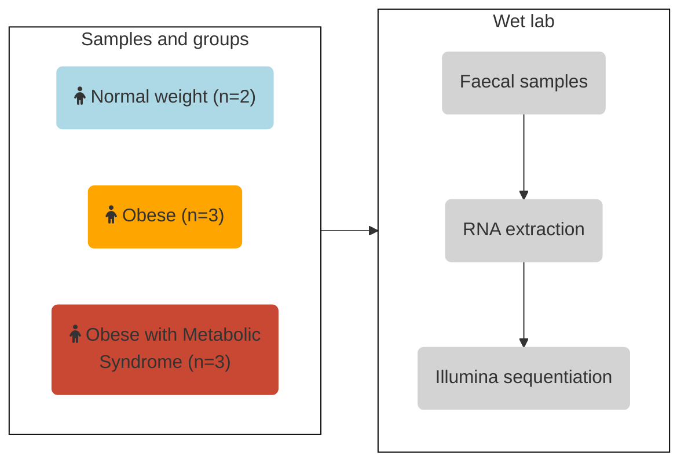
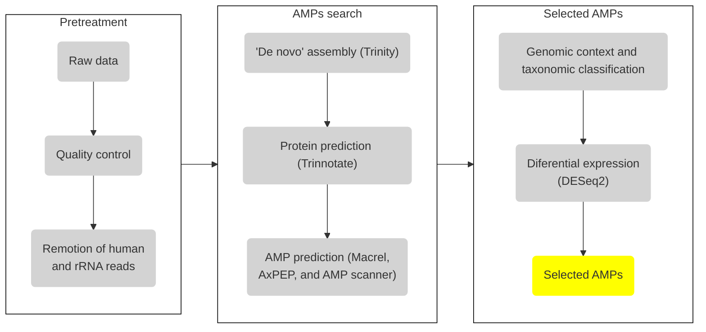
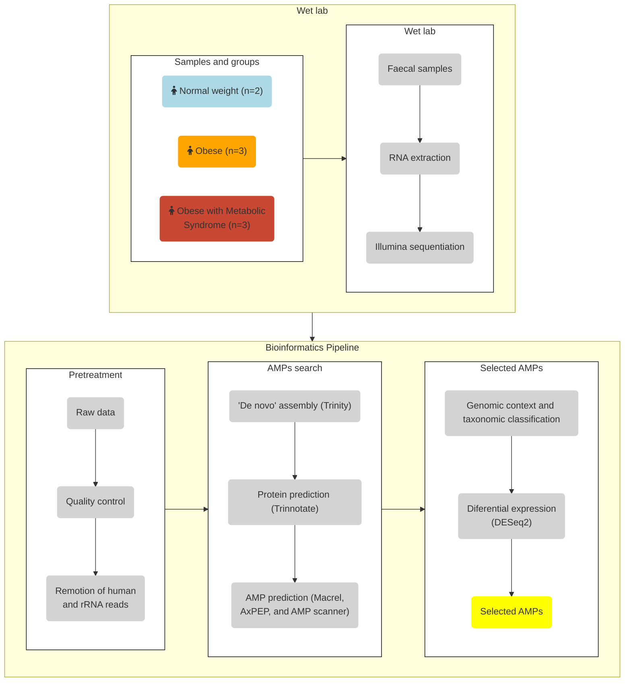

# Antimicrobial peptides in human metatranscriptome

## Wet lab

```mermaid
flowchart LR
    subgraph groups["Samples and groups"]
        direction LR
        nw("fa:fa-child Normal weight (n=2)"):::blue
        obese("fa:fa-child Obese (n=3)"):::orange
        oms("fa:fa-child Obese with Metabolic\nSyndrome (n=3)"):::red
    end

    subgraph wet_lab["Wet lab"]
        faecal("Faecal samples"):::gray
        faecal --> rna("RNA extraction"):::gray
        rna --> sequences("Illumina sequentiation"):::gray
    end

    groups:::block --> wet_lab:::block

    classDef block fill:white, stroke:black
    classDef blue fill:lightblue, stroke:lightblue
    classDef orange fill:orange, stroke:orange
    classDef red fill:#c94834, stroke:#c94834
    classDef gray fill:lightgray, stroke:lightgray
```

## Bioinformatics

```mermaid
flowchart LR
    subgraph pretreatment["Pretreatment"]
        rawdata("Raw data"):::gray
        rawdata --> qc("Quality control"):::gray
        qc --> depletion("Remotion of human\n and rRNA reads"):::gray
    end

    subgraph amps_search["AMPs search"]
        assembly("'De novo' assembly (Trinity)"):::gray
        assembly --> protein_prediction("Protein prediction (Trinnotate)"):::gray
        protein_prediction --> amp_prediction("AMP prediction (Macrel,\n AxPEP, and AMP scanner)"):::gray
    end
    
    subgraph diff_expr["Selected AMPs"]
    		genomic_context("Genomic context and taxonomic classification"):::gray
        genomic_context --> deseq2("Diferential expression\n (DESeq2)"):::gray
        deseq2 --> final_amps("Selected AMPs"):::yellow
    end

    pretreatment:::block --> amps_search:::block --> diff_expr:::block

    classDef block fill:white, stroke:black
    classDef gray fill:lightgray, stroke:lightgray
    classDef yellow fill:yellow, stroke:yellow
```

## Complete

```mermaid
flowchart
	subgraph wetlab["Wet lab"]
		direction LR
        
        subgraph groups["Samples and groups"]
            direction LR
            nw("fa:fa-child Normal weight (n=2)"):::blue
            obese("fa:fa-child Obese (n=3)"):::orange
            oms("fa:fa-child Obese with Metabolic\nSyndrome (n=3)"):::red
        end

        subgraph wet_lab["Wet lab"]
            faecal("Faecal samples"):::gray
            faecal --> rna("RNA extraction"):::gray
            rna --> sequences("Illumina sequentiation"):::gray
        end

        groups:::block --> wet_lab:::block
    end

    subgraph bioinformatics["Bioinformatics Pipeline"]
        direction LR
        
        subgraph pretreatment["Pretreatment"]
            rawdata("Raw data"):::gray
            rawdata --> qc("Quality control"):::gray
            qc --> depletion("Remotion of human\n and rRNA reads"):::gray
        end

        subgraph amps_search["AMPs search"]
            assembly("'De novo' assembly (Trinity)"):::gray
            assembly --> protein_prediction("Protein prediction (Trinnotate)"):::gray
            protein_prediction --> amp_prediction("AMP prediction (Macrel,\n AxPEP, and AMP scanner)"):::gray
        end
    
        subgraph diff_expr["Selected AMPs"]
            genomic_context("Genomic context and taxonomic classification"):::gray
            genomic_context --> deseq2("Diferential expression\n (DESeq2)"):::gray
            deseq2 --> final_amps("Selected AMPs"):::yellow
        end

        pretreatment:::block --> amps_search:::block --> diff_expr:::block
    end

    wetlab --> bioinformatics

    classDef block fill:white, stroke:black
    classDef blue fill:lightblue, stroke:lightblue
    classDef orange fill:orange, stroke:orange
    classDef red fill:#c94834, stroke:#c94834
    classDef gray fill:lightgray, stroke:lightgray
    classDef yellow fill:yellow, stroke:yellow
```

