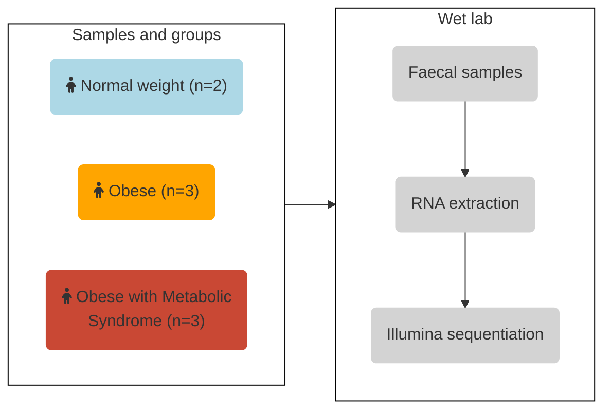
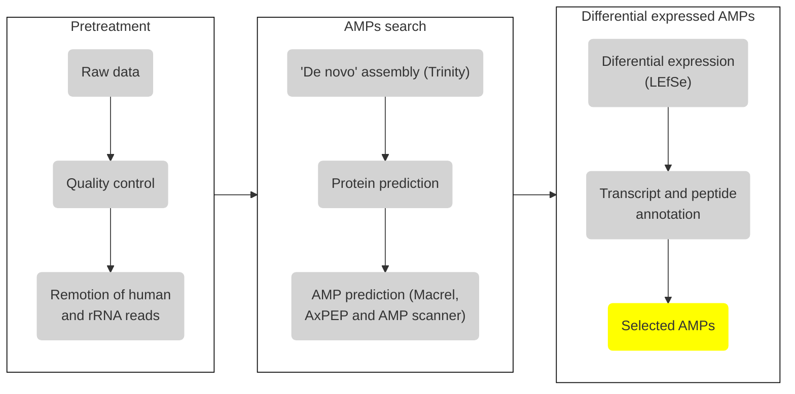
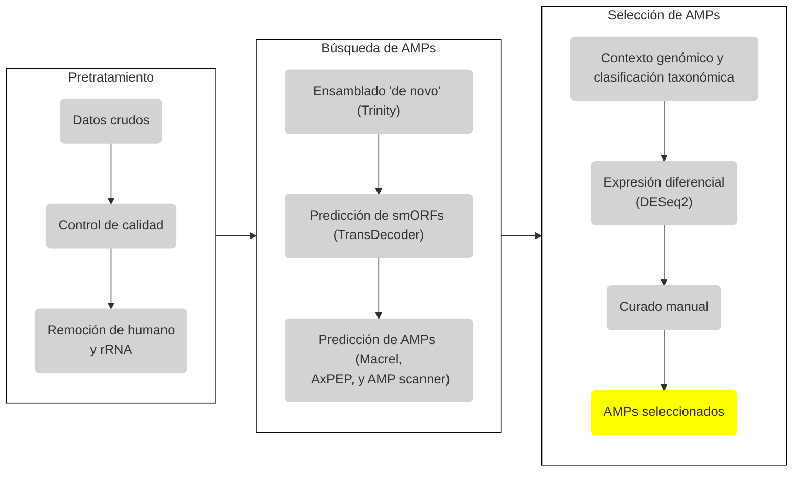
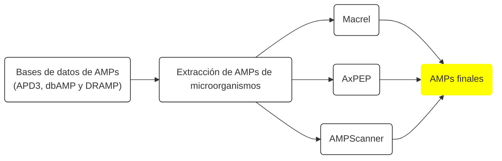

# Antimicrobial peptides in human metatranscriptome

## Wet lab

```mermaid
flowchart LR
    subgraph groups["Samples and groups"]
        direction LR
        nw("fa:fa-child Normal weight (n=2)"):::blue
        obese("fa:fa-child Obese (n=3)"):::orange
        oms("fa:fa-child Obese with Metabolic\nSyndrome (n=3)"):::red
    end

    subgraph wet_lab["Wet lab"]
        faecal("Faecal samples"):::gray
        faecal --> rna("RNA extraction"):::gray
        rna --> sequences("Illumina sequentiation"):::gray
    end

    groups:::block --> wet_lab:::block

    classDef block fill:white, stroke:black
    classDef blue fill:lightblue, stroke:lightblue
    classDef orange fill:orange, stroke:orange
    classDef red fill:#c94834, stroke:#c94834
    classDef gray fill:lightgray, stroke:lightgray
```

## Bioinformatics

```mermaid
flowchart LR
    subgraph pretreatment["Pretreatment"]
        rawdata("Raw data"):::gray
        rawdata --> qc("Quality control"):::gray
        qc --> depletion("Remotion of human\n and rRNA reads"):::gray
    end

    subgraph amps_search["AMPs search"]
        assembly("'De novo' assembly (Trinity)"):::gray
        assembly --> protein_prediction("Protein prediction"):::gray
        protein_prediction --> amp_prediction("AMP prediction (Macrel,\n AxPEP and AMP scanner)"):::gray
    end
    
    subgraph diff_expr["Differential expressed AMPs"]
        lefse("Diferential expression\n (LEfSe)"):::gray
        lefse --> annotation("Transcript and peptide\n annotation"):::gray
        annotation --> final_amps("Selected AMPs"):::yellow
    end

    pretreatment:::block --> amps_search:::block --> diff_expr:::block

    classDef block fill:white, stroke:black
    classDef gray fill:lightgray, stroke:lightgray
    classDef yellow fill:yellow, stroke:yellow
```

## Bioinformatics

```mermaid
flowchart LR
    subgraph pretreatment["Pretratamiento"]
        rawdata("Datos crudos"):::gray
        rawdata --> qc("Control de calidad"):::gray
        qc --> depletion("Remoción de humano\n y rRNA"):::gray
    end

    subgraph amps_search["Búsqueda de AMPs"]
        assembly("Ensamblado 'de novo' (Trinity)"):::gray
        assembly --> protein_prediction("Predicción de smORFs (TransDecoder)"):::gray
        protein_prediction --> amp_prediction("Predicción de AMPs (Macrel,\n AxPEP, y AMP scanner)"):::gray
    end
    
    subgraph diff_expr["Selección de AMPs"]
    		genomic_context("Contexto genómico y clasificación taxonómica"):::gray
        genomic_context --> deseq2("Expresión diferencial\n (DESeq2)"):::gray
        deseq2 --> manual_curation("Curado manual"):::gray 
        manual_curation --> final_amps("AMPs seleccionados"):::yellow
    end

    pretreatment:::block --> amps_search:::block --> diff_expr:::block

    classDef block fill:white, stroke:black
    classDef gray fill:lightgray, stroke:lightgray
    classDef yellow fill:yellow, stroke:yellow
```

## Prueba con bases de datos

```mermaid
flowchart LR
		databases("Bases de datos de AMPs\n(APD3, dbAMP y DRAMP)"):::block --> microbial_amps("Extracción de AMPs de microorganismos"):::block
		microbial_amps --> macrel("Macrel"):::block
		microbial_amps --> axpep("AxPEP"):::block
		microbial_amps --> amp_scanner("AMPScanner"):::block
		
		macrel --> final_amps("AMPs finales"):::yellow
		axpep --> final_amps("AMPs finales"):::yellow
		amp_scanner --> final_amps("AMPs finales"):::yellow

    classDef block fill:white, stroke:black
    classDef gray fill:lightgray, stroke:lightgray
    classDef yellow fill:yellow, stroke:yellow
```